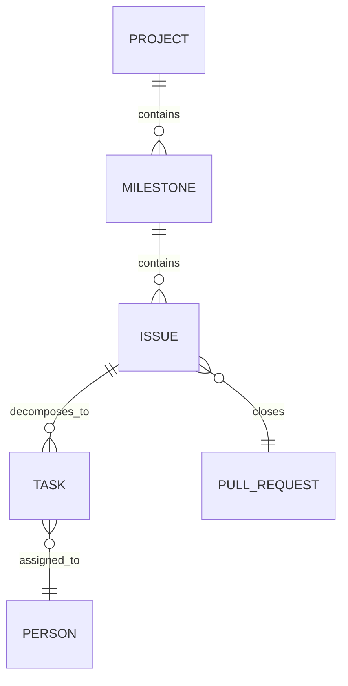
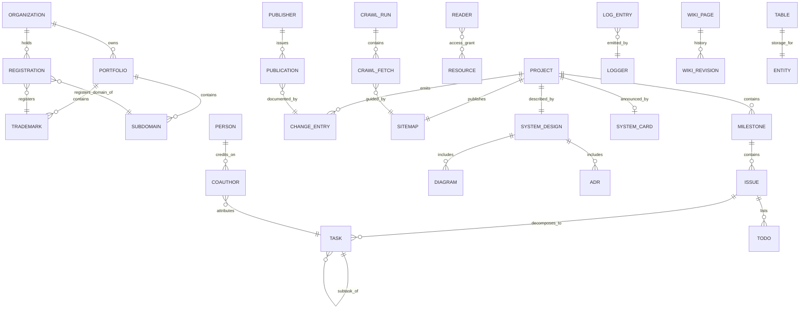

# AKW Canonical Entity Glossary

A reference for the project's vocabulary. Every term is defined in four layers:

1. **Legal / dictionary** — the authoritative generalized meaning
2. **Information-systems entity** — how it behaves as an object class in a data system
3. **Canonical data-object shape** — the exact representation this project uses (TypeScript/GraphQL/SQL/Markdown as appropriate)
4. **AKW connection** — how it fits the agentknowledgeworkers.com + kwpc architecture

Terms are alphabetical. A brief appendix maps each to the relational graph.

---

## changelog

**1. Legal / dictionary.** A changelog is a chronological record of notable changes made to a product, service, or contract. In software, the convention was codified by [keepachangelog.com](https://keepachangelog.com), which defines it as "a curated, chronologically ordered list of notable changes for each version of a project." The word carries no statutory weight on its own, but changelogs are frequently referenced in SaaS agreements, open-source licenses, and procurement clauses as the authoritative record of what changed between versioned releases.

**2. Information-systems entity.** An append-only time-series of `ChangeEntry` records. Each entry is keyed by `(project_id, version, change_type)` and references zero or more source commits, pull requests, or issues. Schema invariants: versions are SemVer-ordered, the current release's entries are immutable once tagged, and `[Unreleased]` is the only mutable section.

**3. Canonical data object.**

```typescript
type ChangeType = "added" | "changed" | "deprecated" | "removed" | "fixed" | "security";

interface ChangeEntry {
  id: string;                    // e.g. "ce_0193..."
  projectId: string;
  version: string;               // SemVer, or "Unreleased"
  releasedAt: string | null;     // ISO 8601 or null if Unreleased
  type: ChangeType;
  title: string;                 // imperative, <80 chars
  body?: string;                 // optional Markdown
  commits: string[];             // short SHAs
  prs: number[];                 // PR numbers
  issues: number[];              // issue numbers
}
```

```graphql
type ChangeEntry {
  id: ID!
  projectId: ID!
  version: String!
  releasedAt: DateTime
  type: ChangeType!
  title: String!
  body: String
  commits: [String!]!
  prs: [Int!]!
  issues: [Int!]!
}
enum ChangeType { ADDED CHANGED DEPRECATED REMOVED FIXED SECURITY }
```

```sql
CREATE TABLE change_entries (
  id          TEXT PRIMARY KEY,
  project_id  TEXT NOT NULL REFERENCES projects(id),
  version     TEXT NOT NULL,
  released_at TIMESTAMPTZ,
  type        TEXT NOT NULL CHECK (type IN ('added','changed','deprecated','removed','fixed','security')),
  title       TEXT NOT NULL,
  body        TEXT,
  commits     TEXT[] NOT NULL DEFAULT '{}',
  prs         INT[]  NOT NULL DEFAULT '{}',
  issues      INT[]  NOT NULL DEFAULT '{}',
  UNIQUE (project_id, version, title)
);
```

**4. AKW connection.** Each of the 16 packages in `knowledge-work-plugins-cli` has its own `CHANGELOG.md` managed by `release-please`. The `/changelog` route on agentknowledgeworkers.com aggregates them via `/api/releases`. Every acceptance-test PR that closes the 8th test becomes an entry. The `type` filter map (`feat`→`ADDED`, `fix`→`FIXED`, `deps`→`CHANGED`) is the same one that hides `chore`/`ci` from the public changelog per ADR 0001.

---

## coauthor

**1. Legal / dictionary.** Under 17 U.S.C. § 201(a), "the authors of a joint work are co-owners of copyright in the work." A coauthor (or "joint author") is a person who contributes copyrightable expression to a work with the intent that their contributions be merged into inseparable or interdependent parts. In git, the `Co-authored-by:` trailer is a conventional (not statutory) way to credit additional contributors on a single commit.

**2. Information-systems entity.** A membership edge between a `Person` and a `Work` (commit, document, design). `Coauthor(person, work, role, weight)`. Distinct from `Author` in that the primary author is usually the row-owner; coauthors are the `N` in a 1:N relationship.

**3. Canonical data object.**

```typescript
interface Coauthor {
  personId: string;
  workId: string;                // commit sha | document id | design id
  role: "co-author" | "reviewer" | "pair" | "ai-assistant";
  attributionLine: string;       // "Co-authored-by: Name <email>"
  weight?: number;               // 0..1, optional contribution weight
}
```

```python
# Python (Pydantic)
from pydantic import BaseModel
from typing import Literal, Optional

class Coauthor(BaseModel):
    person_id: str
    work_id: str
    role: Literal["co-author", "reviewer", "pair", "ai-assistant"]
    attribution_line: str
    weight: Optional[float] = None
```

```sql
CREATE TABLE coauthors (
  person_id         TEXT NOT NULL REFERENCES people(id),
  work_id           TEXT NOT NULL,
  role              TEXT NOT NULL,
  attribution_line  TEXT NOT NULL,
  weight            NUMERIC(3,2),
  PRIMARY KEY (person_id, work_id)
);
```

**4. AKW connection.** Commits produced via Claude Code carry `Co-authored-by: Claude <noreply@anthropic.com>` trailers. The tracker's task-detail panel exposes coauthors for any commit that closed an acceptance test. Policy: every AKW artifact produced with AI assistance names the AI as a coauthor at commit time — transparent attribution, reviewable in git log.

---

## crawl

**1. Legal / dictionary.** A crawl (or "web crawl") is the automated traversal of a website by a software agent that follows links and retrieves content. The lawful scope of crawls is governed by several instruments: (a) the Computer Fraud and Abuse Act, 18 U.S.C. § 1030, when authorization is disputed; (b) site terms of service; and (c) the de-facto industry norms expressed in `robots.txt` (per RFC 9309) and sitemap/llms.txt conventions. The Ninth Circuit in *hiQ Labs v. LinkedIn* (2022) affirmed that scraping publicly accessible data does not by itself violate the CFAA.

**2. Information-systems entity.** A `CrawlRun` is a stateful traversal bounded by a root URL, a policy (robots/llms/sitemap), a depth limit, and a time window. Each run produces `N` `CrawlFetch` records, each of which references one URL, its HTTP response, and a parsed representation.

**3. Canonical data object.**

```typescript
interface CrawlRun {
  id: string;
  agent: "googlebot" | "claudebot" | "gptbot" | "custom";
  rootUrl: string;
  policy: {
    robotsTxt: boolean;          // honor robots.txt
    sitemapXml?: string;         // URL to sitemap
    llmsTxt?: string;            // URL to llms.txt
    maxDepth: number;
    maxUrls: number;
    maxBytes: number;
  };
  startedAt: string;
  endedAt?: string;
  status: "queued" | "running" | "completed" | "aborted";
}

interface CrawlFetch {
  id: string;
  runId: string;
  url: string;
  status: number;                // HTTP status
  fetchedAt: string;
  contentHash: string;
  bytes: number;
  parsedAs: "html" | "markdown" | "xml" | "json" | "binary";
  linksDiscovered: string[];
}
```

```graphql
type CrawlRun {
  id: ID!
  agent: String!
  rootUrl: String!
  policy: CrawlPolicy!
  startedAt: DateTime!
  endedAt: DateTime
  status: CrawlStatus!
  fetches(first: Int = 50, after: String): CrawlFetchConnection!
}
```

**4. AKW connection.** The site exposes three crawl-control artifacts at the root:

- `/robots.txt` — standard user-agent allow/deny
- `/sitemap.xml` — every public page that belongs in search indexes
- `/llms.txt` — a Markdown-formatted curated outline for LLM crawlers, per the [llms.txt proposal](https://llmstxt.org)

The staging subdomain (`staging.agentknowledgeworkers.com`) serves a `robots.txt` that disallows *all* agents, keeping pre-release content out of every crawl. Production serves a permissive set with explicit Googlebot/Bingbot allowance and a `llms.txt` that surfaces the `/adr`, `/plugins/*`, and `/changelog` routes for LLM comprehension.

---

## data model

**1. Legal / dictionary.** A data model is an abstract representation of the entities in a domain, the attributes of each entity, and the relationships among them. In regulatory contexts (e.g., HIPAA, GDPR, SOX) data models are referenced as the controlling artifact for determining what personal or financial data a system holds and how it is processed. No single statute defines "data model"; the term traces to Codd's 1970 relational paper and ISO/IEC 19763 metamodel family.

**2. Information-systems entity.** A data model is the *schema* — the type system against which all runtime records are validated. Conventionally split into three layers:

- **Conceptual** — what exists (entities and relationships, no implementation detail)
- **Logical** — the attributes and keys, still tech-agnostic
- **Physical** — the concrete tables, columns, types in a specific database

**3. Canonical data-object representation.** The AKW canonical is: *every data model must be expressible equivalently in TypeScript, Python, GraphQL, and SQL*. Example, a generic `Entity`:

```typescript
// TypeScript (the front-end contract)
interface Entity<T extends string = string> {
  id: string;
  kind: T;
  createdAt: string;             // ISO 8601
  updatedAt: string;
  attributes: Record<string, unknown>;
}
```

```python
# Python (the back-end contract, Pydantic v2)
from pydantic import BaseModel
from datetime import datetime
from typing import Generic, TypeVar, Any

K = TypeVar("K", bound=str)

class Entity(BaseModel, Generic[K]):
    id: str
    kind: K
    created_at: datetime
    updated_at: datetime
    attributes: dict[str, Any]
```

```graphql
# GraphQL (the wire contract)
interface Entity {
  id: ID!
  kind: String!
  createdAt: DateTime!
  updatedAt: DateTime!
}
# Concrete types extend Entity with their own attribute fields.
```

```sql
-- SQL (the storage contract)
CREATE TABLE entities (
  id          TEXT PRIMARY KEY,
  kind        TEXT NOT NULL,
  created_at  TIMESTAMPTZ NOT NULL DEFAULT now(),
  updated_at  TIMESTAMPTZ NOT NULL DEFAULT now(),
  attributes  JSONB NOT NULL DEFAULT '{}'::jsonb
);
CREATE INDEX entities_kind_idx ON entities (kind);
```

**4. AKW connection.** `packages/schema` (per ADR 0003) holds the canonical data models. Source of truth: `.graphql` files. Generated outputs: TypeScript types for the website, Pydantic models for any Python plugins, SQL migrations for a future read-replica. When a model changes, the schema package is versioned and every consumer consumes the new version — there is no drift between the tracker UI and the plugins reading/writing the same entity.

---

## diagram

**1. Legal / dictionary.** A diagram is a visual representation of information, relationships, or processes using symbols and connectors. In patent law, diagrams (specifically "drawings") are required under 35 U.S.C. § 113 when necessary to understand an invention. In software documentation, the term is generic but standards exist: UML (ISO/IEC 19501), C4 model, ArchiMate, and the Entity-Relationship (E-R) notation introduced by Peter Chen (1976) are the most common.

**2. Information-systems entity.** A `Diagram` is a document whose payload is structured markup (Mermaid, PlantUML, DOT, SVG) rather than free-form prose. Four principal subtypes track to the AKW project:

- **System diagram** — boxes and arrows showing services, queues, databases
- **Architecture flow** — the runtime path of a request or data stream
- **Entity-relationship diagram (ERD)** — tables and foreign keys
- **Sequence diagram** — time-ordered interactions between actors

**3. Canonical data object.**

```typescript
interface Diagram {
  id: string;
  kind: "system" | "flow" | "erd" | "sequence" | "state";
  title: string;
  source: string;                // Mermaid/PlantUML/DOT text
  sourceFormat: "mermaid" | "plantuml" | "dot" | "svg";
  renderedSvg?: string;          // cached render
  relatedAdrs: string[];         // ADR numbers
  relatedEntities: string[];     // entity ids this diagram describes
}
```

Example stored value — a Mermaid ERD for a slice of the AKW tracker:



**4. AKW connection.** Diagrams live in `kwpc/docs/design/` as Mermaid fenced-code blocks in Markdown, so they render natively on GitHub and in the website's markdown renderer. ADR 0003's "five layers" diagram, the dogfooding loop, and the ERD above all belong there. Build-time step: a script extracts Mermaid blocks and caches SVGs for faster page rendering, but the source of truth stays the Markdown.

---

## logger

**1. Legal / dictionary.** A logger is any instrument, software or otherwise, that produces a sequential record of events. In evidentiary law, logs are admissible as business records under Federal Rule of Evidence 803(6) when maintained in the regular course of business. In computing, a logger is the program object that emits structured records; the records themselves are *log entries*. RFC 5424 standardizes syslog; OpenTelemetry (CNCF) is the current cross-language convention for structured logs, traces, and metrics.

**2. Information-systems entity.** A `Logger` is a named, hierarchical emitter. Each emission produces a `LogEntry` with a severity level, timestamp, message, and attributes. Loggers typically form a tree rooted at the application or module name (`kwpc.schema.graphql_client`, `akw.site.api.projects`).

**3. Canonical data object.**

```typescript
type LogLevel = "trace" | "debug" | "info" | "warn" | "error" | "fatal";

interface LogEntry {
  ts: string;                    // ISO 8601 with ms
  logger: string;                // dotted name
  level: LogLevel;
  message: string;
  attributes: Record<string, unknown>;
  traceId?: string;
  spanId?: string;
  error?: { type: string; message: string; stack?: string };
}
```

```python
# Python (stdlib logging + structlog convention)
import structlog

log = structlog.get_logger("akw.api.projects")
log.info("fetched", project_id="akw-site", cache="hit", ms=14)
```

```sql
CREATE TABLE log_entries (
  ts          TIMESTAMPTZ NOT NULL,
  logger      TEXT NOT NULL,
  level       TEXT NOT NULL,
  message     TEXT NOT NULL,
  attributes  JSONB NOT NULL DEFAULT '{}',
  trace_id    TEXT,
  span_id     TEXT,
  PRIMARY KEY (ts, logger, trace_id)
);
```

**4. AKW connection.** Cloudflare Workers/Pages Functions emit structured logs to Logpush, which we tail into an R2 bucket for 30-day retention. Each log entry carries a `traceId` that ties together (a) the inbound request to the site, (b) the GraphQL call from the Pages Function to GitHub, and (c) any downstream cache hit/miss on KV. For the kwpc CLI plugins, `claude` writes to `~/.claude/logs/` with the same JSON Lines format, so the CLI and the site use one logging grammar.

---

## portfolio

**1. Legal / dictionary.** A portfolio, in an enterprise context, is a curated collection of assets held by a single legal entity. In intellectual property, the phrase "trademark portfolio" refers to the set of marks owned by a company — including registered marks, pending applications, and marks protected under common-law use. USPTO's TSDR database exposes the portfolio of any owner by serial number. Financial regulators (SEC) use "portfolio" in the distinct sense of investment holdings; both usages share the "collection owned by one entity" meaning.

**2. Information-systems entity.** A `Portfolio` is a 1:N container owned by an `Organization`. It aggregates instances of some asset class (brands, domains, repos, funds). The portfolio itself has metadata (name, purpose, steward); the contained assets retain their own identities.

**3. Canonical data object.**

```typescript
interface Portfolio<TAsset extends Entity> {
  id: string;
  organizationId: string;
  name: string;
  kind: "brand" | "domain" | "repo" | "trademark" | "patent" | "investment";
  stewardId: string;             // person responsible
  assets: TAsset[];
  createdAt: string;
}
```

```graphql
type BrandPortfolio {
  id: ID!
  organization: Organization!
  name: String!
  steward: Person!
  brands(first: Int = 20): BrandConnection!
}
```

```sql
CREATE TABLE portfolios (
  id               TEXT PRIMARY KEY,
  organization_id  TEXT NOT NULL REFERENCES organizations(id),
  name             TEXT NOT NULL,
  kind             TEXT NOT NULL,
  steward_id       TEXT REFERENCES people(id),
  created_at       TIMESTAMPTZ NOT NULL DEFAULT now()
);
CREATE TABLE portfolio_items (
  portfolio_id     TEXT NOT NULL REFERENCES portfolios(id),
  asset_kind       TEXT NOT NULL,
  asset_id         TEXT NOT NULL,
  added_at         TIMESTAMPTZ NOT NULL DEFAULT now(),
  PRIMARY KEY (portfolio_id, asset_id)
);
```

**4. AKW connection.** Agent Knowledge Workers is an organization that holds (at minimum): a domain portfolio (`agentknowledgeworkers.com`, any staging/preview subdomains), a brand portfolio (the AKW wordmark, kwpc product mark), a trademark portfolio (any filed marks, see the `trademark` entry), and a repo portfolio (the two GitHub repos). A future `/brand` page on the site can render the brand portfolio directly from this structure.

---

## publisher

**1. Legal / dictionary.** A publisher is a person or entity that makes a work available to the public. Publishing is the historic predicate for several legal doctrines: copyright notice (pre-1989, per 17 U.S.C. § 401), defamation (per NYT v. Sullivan, 1964, which distinguishes publishers from distributors), and Section 230 of the Communications Decency Act (47 U.S.C. § 230), which shields interactive computer services from being treated as publishers of third-party content. Colloquially in software: whoever pushes the release button.

**2. Information-systems entity.** A `Publisher` is an identity authorized to transition a `Publication` from `draft` to `published`. It is an actor role, not a document type. Maps to npm's "publisher" (an npm user with publish rights to a scope), GitHub's "release author" (whoever ran `gh release create`), and the academic "journal publisher."

**3. Canonical data object.**

```typescript
interface Publisher {
  id: string;
  kind: "person" | "org" | "bot";
  displayName: string;
  scopes: string[];              // e.g. ["@agentknowledgeworkers"]
  credentials: {
    npmUser?: string;
    githubLogin?: string;
  };
}

interface Publication {
  id: string;
  title: string;
  publisherId: string;
  publishedAt: string;
  version: string;
  artifactUrl: string;           // npm, GitHub release, CDN
}
```

```sql
CREATE TABLE publishers (
  id            TEXT PRIMARY KEY,
  kind          TEXT NOT NULL CHECK (kind IN ('person','org','bot')),
  display_name  TEXT NOT NULL,
  scopes        TEXT[] NOT NULL DEFAULT '{}',
  credentials   JSONB NOT NULL DEFAULT '{}'
);
```

**4. AKW connection.** Two publishers in the AKW system: the human maintainer (who can `gh release create` on the site repo) and the `release-please` bot (which publishes the 14 plugins to npm under `@agentknowledgeworkers/*` when a release PR merges). The bot's `NPM_TOKEN` secret defines its scope. Every publication is logged to the tracker as a `ChangeEntry` and surfaced on `/changelog`.

---

## reader

**1. Legal / dictionary.** In information law, a "reader" is the consumer counterpart to a publisher — the person or system that consumes a published work. The term carries specific force in privacy law: California's Reader Privacy Act (Civil Code § 1798.90) and similar state statutes constrain what records of a reader's access may be disclosed. In storage systems, a reader is also a *role* on a resource (distinct from writer/owner) per RBAC conventions.

**2. Information-systems entity.** A `Reader` is a principal with read-only access to a resource. In RBAC, `reader` is the least-privileged grant that still permits retrieval. In event-sourced systems, a "reader" or "projection" is a component that consumes the event log and materializes views.

**3. Canonical data object.**

```typescript
interface AccessGrant {
  principalId: string;           // person or service id
  resourceId: string;
  role: "owner" | "writer" | "reader" | "commenter";
  grantedAt: string;
  grantedBy: string;
  expiresAt?: string;
}
```

```graphql
type AccessGrant {
  principal: Principal!
  resource: Resource!
  role: AccessRole!
  grantedAt: DateTime!
  grantedBy: Principal!
  expiresAt: DateTime
}
enum AccessRole { OWNER WRITER READER COMMENTER }
```

**4. AKW connection.** Three reader tiers on the AKW site: public readers of production (`agentknowledgeworkers.com`, no auth), authenticated readers of staging/previews (Cloudflare Access members), and programmatic readers (the GitHub fine-grained PAT used by the `/api/projects` Pages Function — a service principal with reader role scoped to the AKW org). Each tier is auditable; Cloudflare Access logs every human read of staging.

---

## registration

**1. Legal / dictionary.** A registration is the act — or the resulting public record — of formally entering a claim, identity, or asset into an authoritative registry. The meaning narrows by context: *trademark registration* (USPTO), *domain registration* (ICANN-accredited registrars under RFC 5730 EPP), *copyright registration* (U.S. Copyright Office under 17 U.S.C. § 408), *business registration* (Secretary of State filings). Each registry has its own legal effect; none automatically grants the protections of the others. Per Cloudflare's own docs, a domain registration covers "WHOIS contacts, nameservers, renewal settings, and privacy options."

**2. Information-systems entity.** A `Registration` is an immutable fact plus a mutable state envelope: who registered what, when, with which registrar, and what the current renewal/expiration state is. Cross-cuts several asset types.

**3. Canonical data object.**

```typescript
type RegistrationKind = "domain" | "trademark" | "copyright" | "business" | "patent";

interface Registration {
  id: string;
  kind: RegistrationKind;
  subject: string;               // domain name, mark text, title, etc.
  registrar: string;             // Cloudflare, USPTO, Secretary of State
  registryId: string;            // serial number, domain record id
  registrant: string;            // legal entity holding the registration
  registeredAt: string;
  expiresAt?: string;
  renewalPolicy: "auto" | "manual" | "none";
  status: "pending" | "active" | "expired" | "abandoned" | "cancelled";
  whois?: Record<string, unknown>; // for domains
}
```

```sql
CREATE TABLE registrations (
  id              TEXT PRIMARY KEY,
  kind            TEXT NOT NULL,
  subject         TEXT NOT NULL,
  registrar       TEXT NOT NULL,
  registry_id     TEXT NOT NULL,
  registrant_id   TEXT NOT NULL REFERENCES organizations(id),
  registered_at   DATE NOT NULL,
  expires_at      DATE,
  renewal_policy  TEXT NOT NULL,
  status          TEXT NOT NULL,
  whois           JSONB,
  UNIQUE (kind, registry_id)
);
```

**4. AKW connection.** Agent Knowledge Workers holds at least the following registrations:

- `agentknowledgeworkers.com` — domain registration, Cloudflare Registrar, auto-renew
- Any filed trademark (pending) — USPTO registration, serial number TBD
- AKW business entity — Secretary of State (the state of incorporation)

Cloudflare's "Registrations" panel is the interface to the first of these. The tracker's future `/settings/registrations` page would surface all three in one view, driven by this single schema.

---

## sitemap

**1. Legal / dictionary.** A sitemap is a machine-readable file enumerating the URLs of a website, intended to aid discovery by crawlers. The technical standard is the Sitemaps XML protocol, jointly authored by Google, Yahoo, and Microsoft and published at [sitemaps.org](https://www.sitemaps.org/protocol.html). No statutory definition exists; sitemaps are a voluntary convention.

**2. Information-systems entity.** A `Sitemap` is a derived document — a projection of the set of publicly crawlable pages filtered by some policy (exclude noindex, exclude staging, exclude drafts). It has a 1:N relationship with `SitemapEntry`.

**3. Canonical data object.**

```typescript
interface SitemapEntry {
  loc: string;                   // absolute URL
  lastmod?: string;              // ISO 8601
  changefreq?: "always" | "hourly" | "daily" | "weekly" | "monthly" | "yearly" | "never";
  priority?: number;             // 0.0–1.0
}

interface Sitemap {
  host: string;                  // e.g. agentknowledgeworkers.com
  generatedAt: string;
  entries: SitemapEntry[];
}
```

The XML serialization, per the protocol:

```xml
<?xml version="1.0" encoding="UTF-8"?>
<urlset xmlns="http://www.sitemaps.org/schemas/sitemap/0.9">
  <url>
    <loc>https://agentknowledgeworkers.com/</loc>
    <lastmod>2026-04-23</lastmod>
  </url>
</urlset>
```

**4. AKW connection.** Built at compile time from the set of routes in `src/routes/` plus dynamic entries for each plugin (`/plugins/data-cli`, …), each ADR (`/adr/0001`, …), and each release. Served at `/sitemap.xml`. Staging serves an empty sitemap (or none) to prevent search indexing of pre-release content.

---

## subdomain

**1. Legal / dictionary.** A subdomain is a DNS-hierarchy label prefixed to a parent domain, uniquely identifying a host or zone within that parent. RFC 1034 defines the hierarchy: "a domain is a subdomain of another domain if it is contained within that domain." No independent legal status — the subdomain inherits the registrant and trademark exposure of its parent registration.

**2. Information-systems entity.** A `Subdomain` is a DNS record (typically A, AAAA, or CNAME) that routes a hostname to an IP address or another hostname. It has a 1:N relationship with deployments — one subdomain may front multiple deployments over time (via DNS updates) but only one at any instant.

**3. Canonical data object.**

```typescript
type DnsRecordType = "A" | "AAAA" | "CNAME" | "ALIAS" | "TXT" | "MX" | "NS";

interface Subdomain {
  hostname: string;              // "staging.agentknowledgeworkers.com"
  parentDomain: string;          // "agentknowledgeworkers.com"
  label: string;                 // "staging"
  records: DnsRecord[];
  environment: "production" | "staging" | "preview" | "other";
  accessPolicy?: {
    provider: "cloudflare-access" | "none";
    applicationId?: string;
  };
}

interface DnsRecord {
  type: DnsRecordType;
  name: string;
  value: string;
  ttl: number;
  proxied: boolean;              // Cloudflare-specific
}
```

**4. AKW connection.** Three subdomain roles in the AKW topology:

- `www.agentknowledgeworkers.com` → CNAME to apex, production
- `staging.agentknowledgeworkers.com` → CNAME to `agentknowledgeworkers.pages.dev`, gated by Cloudflare Access
- `*.agentknowledgeworkers.pages.dev` → wildcard for PR previews, gated by Cloudflare Access

Ties directly to ADR-to-come on environment topology (three-env, branch-driven).

---

## subtask

**1. Legal / dictionary.** Subtask is a plain-language term; no statutory definition. In project-management tradition (PMBOK), it is "a smaller unit of work into which a task has been decomposed." In GitHub's model, subtasks are formalized as *sub-issues* (per GitHub's 2024+ sub-issue feature) — an explicit parent/child edge between two issues.

**2. Information-systems entity.** A `Subtask` is a child record in a recursive tree rooted at a `Task` or `Issue`. The parent relationship is strict (one parent). Completion of a parent is commonly gated on completion of all subtasks.

**3. Canonical data object.**

```typescript
interface Task {
  id: string;
  parentId: string | null;
  title: string;
  status: "pending" | "in_progress" | "completed" | "cancelled";
  tool?: string;                 // Claude Code tool name
  createdAt: string;
  completedAt?: string;
  ownerId?: string;
  depth: number;                 // 0 for root tasks
}
```

```graphql
type Task {
  id: ID!
  parent: Task
  children: [Task!]!
  title: String!
  status: TaskStatus!
  tool: String
  depth: Int!
}
```

```sql
CREATE TABLE tasks (
  id          TEXT PRIMARY KEY,
  parent_id   TEXT REFERENCES tasks(id) ON DELETE CASCADE,
  title       TEXT NOT NULL,
  status      TEXT NOT NULL,
  tool        TEXT,
  created_at  TIMESTAMPTZ NOT NULL DEFAULT now(),
  completed_at TIMESTAMPTZ,
  owner_id    TEXT REFERENCES people(id)
);
CREATE INDEX tasks_parent_idx ON tasks (parent_id);
```

**4. AKW connection.** Matches Claude Code's canonical task model (`TaskCreate`/`TaskUpdate`/`TaskList`). The tracker's Milestone → Issue → Task → Subtask tree renders this directly. `product-management-cli /sprint-planning` produces subtasks from issues; `productivity-cli /my-tasks` renders the user's subtask slice.

---

## system card

**1. Legal / dictionary.** A system card is a public document describing an AI system's capabilities, limitations, safety evaluations, and release decisions. The form emerged from Google's "Model Cards" (Mitchell et al., 2019) and has been extended by Anthropic, OpenAI, and others into broader "system cards" covering deployment context, not just the model. No statute defines it, but it is increasingly referenced in procurement contracts and regulatory discussions (EU AI Act Article 11 requires comparable technical documentation for high-risk AI).

**2. Information-systems entity.** A `SystemCard` is a structured document with a fixed set of sections and a 1:1 relationship to a released or documented system. It is immutable once published; updates are issued as new versions of the card.

**3. Canonical data object.**

```typescript
interface SystemCard {
  id: string;
  subject: string;               // "Claude Opus 4.6", "kwpc 1.0"
  version: string;
  publishedAt: string;
  sections: {
    overview: string;
    capabilities: CapabilityEval[];
    safetyEvaluations: SafetyEval[];
    alignmentAssessment?: string;
    limitations: string[];
    releaseDecision: string;
    assuranceLevel?: string;     // e.g. "ASL-3"
  };
  artifactUrl: string;           // PDF or Markdown
}

interface CapabilityEval {
  benchmark: string;
  score: number | string;
  comparisonBaseline?: string;
}
```

```sql
CREATE TABLE system_cards (
  id             TEXT PRIMARY KEY,
  subject        TEXT NOT NULL,
  version        TEXT NOT NULL,
  published_at   TIMESTAMPTZ NOT NULL,
  sections       JSONB NOT NULL,
  artifact_url   TEXT NOT NULL,
  UNIQUE (subject, version)
);
```

**4. AKW connection.** Anthropic publishes system cards for every Claude release (Opus 4.5, 4.6, Sonnet 4.6, Mythos Preview). When kwpc reaches 1.0, AKW will publish a lightweight "suite card" with the same section structure: capabilities (the 8-test pass rates), safety (which plugins write external side effects, permission scopes), limitations, release decision. Hosted at `agentknowledgeworkers.com/suite-card`, versioned per suite release.

---

## system design

**1. Legal / dictionary.** System design is the practice of defining the architecture, components, interfaces, and data flows of a system so it meets specified requirements. The term spans engineering disciplines; ISO/IEC/IEEE 15288 codifies it for systems engineering. In software, "system design" conventionally names the phase after requirements and before implementation, producing artifacts such as architecture diagrams, ADRs, interface specs, and capacity plans.

**2. Information-systems entity.** A `SystemDesign` is a set of artifacts, not a single document: an architecture overview, a stack of ADRs, one or more diagrams, an interface spec, and a set of non-functional-requirement targets (latency, reliability, scalability). Versioned alongside the system it describes.

**3. Canonical data object.**

```typescript
interface SystemDesign {
  id: string;
  systemId: string;
  version: string;
  artifacts: {
    architectureDocPath: string; // ARCHITECTURE.md
    adrPaths: string[];          // docs/adr/*.md
    diagrams: Diagram[];
    interfaceSpecs: InterfaceSpec[];
    nfrTargets: NfrTarget[];
  };
  lastReviewedAt: string;
}

interface NfrTarget {
  dimension: "latency" | "availability" | "throughput" | "cost" | "security";
  metric: string;                // "p99 < 200ms"
  currentValue?: string;
}
```

**4. AKW connection.** The kwpc system design is the union of `ARCHITECTURE.md`, `docs/adr/0001…0006`, the Mermaid diagrams embedded in those docs, the GraphQL schema in `packages/schema`, and the NFR targets documented in `docs/design/nfr.md` (to be written). Any change to the topology requires an ADR; any change to the NFRs is logged under `ci`-commits that don't cut a release but do update the design doc. Per ADR 0000 (template) the system design evolves by addition, not edit — old ADRs are superseded, not overwritten.

---

## table

**1. Legal / dictionary.** A table is a two-dimensional arrangement of data in rows and columns. No independent legal meaning; tables are the primary presentation form for codified data (statutory tables, rate schedules, tax tables). In the relational model (Codd, 1970), a table is the physical realization of a *relation*: a set of tuples sharing a common header. SQL:2016 formalizes tables as base tables or views.

**2. Information-systems entity.** A `Table` is a named collection of typed columns and untyped-cardinality rows. Tables are the storage-layer entity; they map upward to `Entity` collections (in ORMs) and downward to files/pages (in storage engines). Three flavors distinguishable at the AKW project scope:

- **Relational tables** — Postgres/SQLite, typed columns, constraints
- **Display tables** — UI components rendering tabular data
- **Document tables** — Markdown/HTML table content

**3. Canonical data object.**

```typescript
// UI-facing table spec (the tracker's table component)
interface DisplayTable<T> {
  columns: Array<{
    key: keyof T & string;
    header: string;
    width?: number;
    align?: "left" | "right" | "center";
    format?: (value: T[keyof T]) => string;
  }>;
  rows: T[];
  sortBy?: { key: keyof T & string; direction: "asc" | "desc" };
  rowKey: (row: T) => string;
}
```

```sql
-- Storage-layer table (SQL DDL, the "table" of record)
CREATE TABLE issues (
  id           TEXT PRIMARY KEY,
  number       INT NOT NULL,
  title        TEXT NOT NULL,
  state        TEXT NOT NULL,
  milestone_id TEXT REFERENCES milestones(id),
  created_at   TIMESTAMPTZ NOT NULL DEFAULT now()
);
```

**4. AKW connection.** The tracker's "Acceptance test status" row uses the `DisplayTable<IssueRow>` shape. The storage layer — today entirely GitHub, tomorrow potentially a read-replica — is modeled as the SQL DDL above. Both derive from the same GraphQL type definitions in `packages/schema`, so the UI table's `columns` array and the SQL `CREATE TABLE` statement can't drift.

---

## todo

**1. Legal / dictionary.** Todo is plain language; no statutory definition. In project management, a todo item is the smallest unit of committed work (PMBOK's "activity"). In software, it is conventionally the checklist form — `- [ ] …` in Markdown, `TODO:` comments in source, or a work-tracking tool's ticket.

**2. Information-systems entity.** A `Todo` is a specialization of `Task` that is typically ephemeral, personal, and lightweight — no owner ceremony, no parent milestone requirement. The AKW model treats `Todo` as a first-class entity when it is embedded in a document (an issue body, a Markdown file) and as a degenerate `Task` when it is tracked in the main system.

**3. Canonical data object.**

```typescript
interface Todo {
  id: string;
  text: string;
  done: boolean;
  // Location — where this todo lives
  source: {
    kind: "markdown" | "issue-body" | "claude-session";
    location: string;            // file path, issue url, session id
    lineNumber?: number;
  };
  addedAt: string;
  completedAt?: string;
}
```

```markdown
<!-- The canonical Markdown form (GFM task list) -->
- [x] Scaffold Vite + React
- [ ] Wire live GitHub data
- [ ] Gate staging with Cloudflare Access
```

**4. AKW connection.** Every AKW session begins with a todo list in the artifact format we've been using (`✅ Completed`, `🎯 Next up`). Those todos promote to `Task` records once they acquire acceptance criteria, a tool assignment, or a parent issue. The demarcation is deliberate: todos are cheap and mutable; tasks are expensive and tracked. A linter can extract `- [ ]` items from `docs/` and emit a todo count for the tracker's "loose work" signal.

---

## trademark

**1. Legal / dictionary.** Per the USPTO, a trademark is "any word, phrase, symbol, design, or a combination of these things that identifies your goods or services." It provides "legal protection for your brand" and "helps guard against counterfeiting and fraud." Rights begin with use in commerce and are limited to the geographic area of use; federal registration extends rights nationwide. A trademark is distinct from:
- a **trade name** ("simply the name of your business," registered at the state level)
- a **domain name** (which "does not give you any trademark rights" per USPTO)
- a **business name** on a Secretary of State filing

The statutory basis is the Lanham Act, 15 U.S.C. § 1051 et seq.

**2. Information-systems entity.** A `Trademark` is a claim record linking an `Organization` to a `Mark` for specified `GoodsOrServices` in one or more `NiceClasses`. It carries a lifecycle state (intent-to-use → filed → published → registered → renewal due → cancelled/abandoned) and a registry identifier (USPTO serial number).

**3. Canonical data object.**

```typescript
type TrademarkFormat = "standard-character" | "special-form" | "sound" | "color" | "scent";
type TrademarkStatus = "unregistered" | "intent-to-use" | "pending" | "published" | "registered" | "renewed" | "cancelled" | "abandoned";

interface Trademark {
  id: string;
  mark: string;                  // the literal mark text
  format: TrademarkFormat;
  owner: string;                 // organization id
  goodsOrServices: string[];
  niceClasses: number[];         // e.g. [9, 42] for software + SaaS
  status: TrademarkStatus;
  registry: "USPTO" | "EUIPO" | "WIPO" | "state";
  serialNumber?: string;
  registrationNumber?: string;
  firstUseInCommerce?: string;   // ISO date
  filedAt?: string;
  registeredAt?: string;
  specimenUrls: string[];        // evidence of use
  designFile?: string;           // SVG/PNG for special-form marks
}
```

```graphql
type Trademark {
  id: ID!
  mark: String!
  format: TrademarkFormat!
  owner: Organization!
  goodsOrServices: [String!]!
  niceClasses: [Int!]!
  status: TrademarkStatus!
  registry: TrademarkRegistry!
  serialNumber: String
  registrationNumber: String
  firstUseInCommerce: Date
  filedAt: Date
  registeredAt: Date
}
```

```sql
CREATE TABLE trademarks (
  id                     TEXT PRIMARY KEY,
  mark                   TEXT NOT NULL,
  format                 TEXT NOT NULL,
  owner_id               TEXT NOT NULL REFERENCES organizations(id),
  nice_classes           INT[] NOT NULL,
  goods_or_services      TEXT[] NOT NULL,
  status                 TEXT NOT NULL,
  registry               TEXT NOT NULL,
  serial_number          TEXT,
  registration_number    TEXT,
  first_use_in_commerce  DATE,
  filed_at               DATE,
  registered_at          DATE
);
```

**4. AKW connection.** "Agent Knowledge Workers" is currently an unregistered trademark (common-law rights arising from use in commerce via the site). Candidate registrations: standard-character mark for "AGENT KNOWLEDGE WORKERS" in Nice Class 9 (downloadable software) and Class 42 (SaaS/platform services); possibly also "KWPC" if the abbreviation acquires source-identifying distinctiveness. The `Trademark` entity joins the `Portfolio` entity (AKW's brand portfolio) and the `Registration` entity (the USPTO filing record). These three compose into a single "brand" view on the site: mark + portfolio membership + registration state.

---

## wiki

**1. Legal / dictionary.** A wiki is a collaborative documentation system that allows multiple authors to edit interconnected pages, typically with version history. The term has no independent legal meaning; wikis are licensed under their chosen terms (MediaWiki + CC-BY-SA for Wikipedia, various for enterprise wikis). The convention of open editing traces to Ward Cunningham's WikiWikiWeb (1995).

**2. Information-systems entity.** A `Wiki` is a collection of `WikiPage` documents with bidirectional edit history. Each page has a canonical URL, a markup payload (Markdown or wikitext), an edit log, and outbound links to other pages. Distinct from a blog (chronological, authored) and from documentation (hierarchical, release-versioned).

**3. Canonical data object.**

```typescript
interface WikiPage {
  id: string;
  slug: string;                  // URL-safe identifier
  title: string;
  body: string;                  // Markdown
  version: number;               // incremented per edit
  revisions: WikiRevision[];
  outboundLinks: string[];       // slugs of linked pages
  tags: string[];
  updatedAt: string;
  updatedBy: string;
}

interface WikiRevision {
  version: number;
  body: string;
  editedBy: string;
  editedAt: string;
  summary?: string;              // edit message
}
```

```sql
CREATE TABLE wiki_pages (
  slug        TEXT PRIMARY KEY,
  title       TEXT NOT NULL,
  body        TEXT NOT NULL,
  version     INT NOT NULL DEFAULT 1,
  tags        TEXT[] NOT NULL DEFAULT '{}',
  updated_at  TIMESTAMPTZ NOT NULL DEFAULT now(),
  updated_by  TEXT NOT NULL
);
CREATE TABLE wiki_revisions (
  slug        TEXT NOT NULL REFERENCES wiki_pages(slug),
  version     INT NOT NULL,
  body        TEXT NOT NULL,
  edited_by   TEXT NOT NULL,
  edited_at   TIMESTAMPTZ NOT NULL DEFAULT now(),
  summary     TEXT,
  PRIMARY KEY (slug, version)
);
```

**4. AKW connection.** The kwpc repo's GitHub Wiki is disabled in favor of in-repo `docs/` — ADR 0002 (GitHub as storage) argues for one source of truth. That said, the `docs/design/` directory is *wiki-shaped*: Markdown files, cross-linked, edit history via git, collaborative via PRs. Treated as a wiki by the website's `/adr` and future `/design` routes.

---

## Relational map

How these entities reference each other in the AKW canonical schema:



## Terms promoted to schema, by tier

**Tier 1 — must exist in `packages/schema` at v0.1:**
`Project`, `Milestone`, `Issue`, `Task` (with subtask recursion), `ChangeEntry`, `Publisher`, `Registration`, `Subdomain`, `Sitemap`

**Tier 2 — Add at v0.2 when content routes land:**
`SystemCard`, `Diagram`, `WikiPage`, `CrawlRun`, `LogEntry`

**Tier 3 — Brand/legal layer, add when trademark filings begin:**
`Organization`, `Portfolio`, `Trademark`, `Coauthor`, `AccessGrant`

**Ambient primitives (not separate tables, but cross-cutting):**
`Todo`, `Table`, `DataModel`, `SystemDesign` — these describe how the others are *represented*, not additional collections.

---

## Deduplicated input

Your source list had `readers` twice and `sregistrations` which I've read as `registrations`. If you meant something different by the duplicate — e.g., a distinct reader/review concept — say so and I'll add it.
