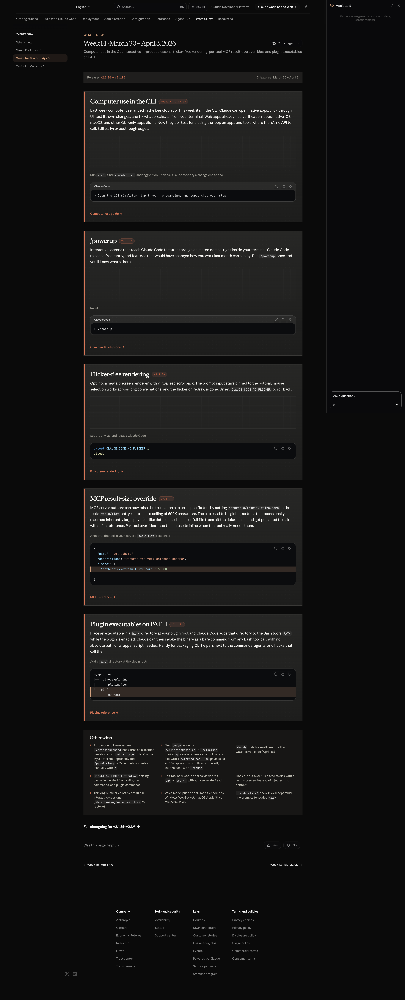
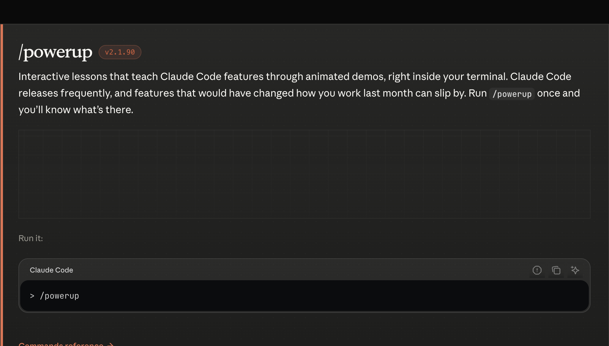
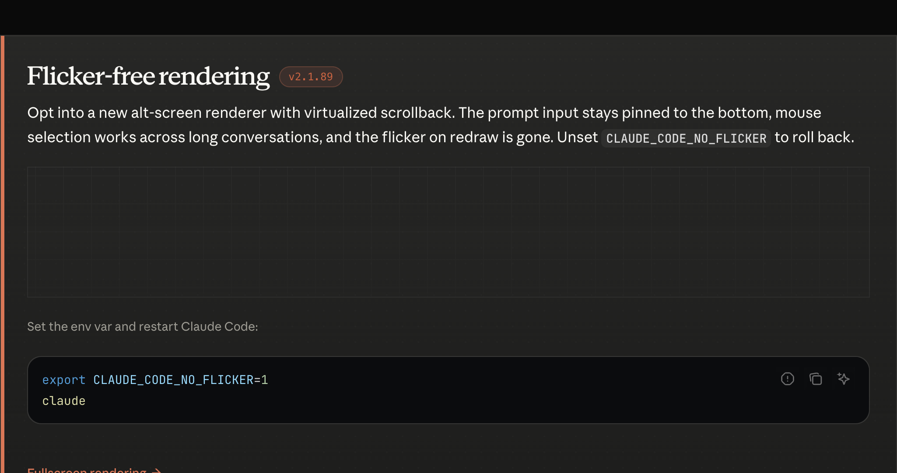
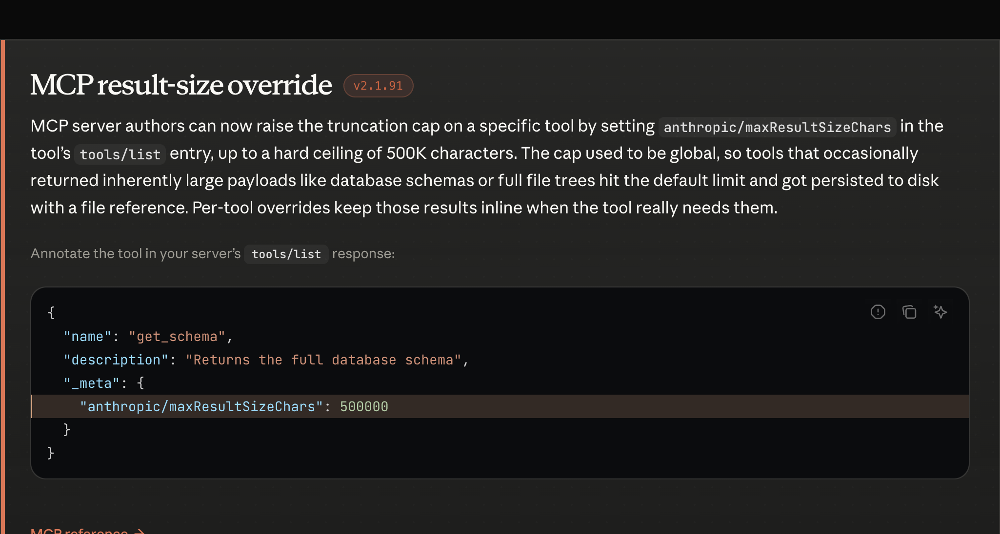
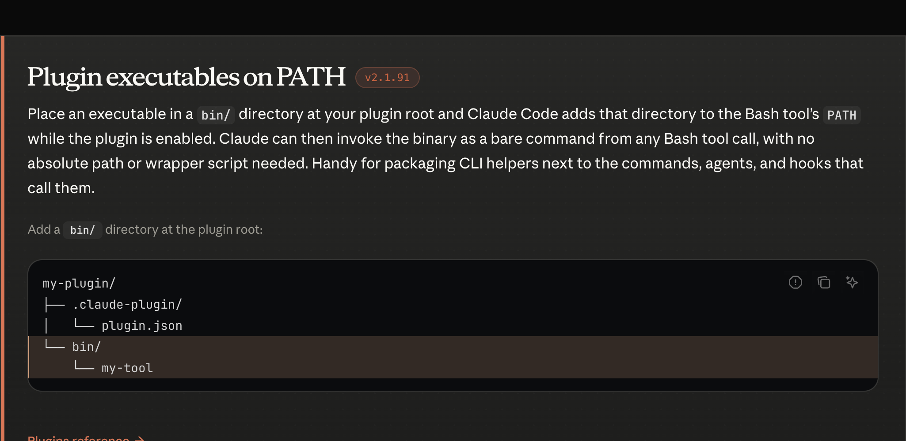

# ROLE

You are **Claude Code** running in a macOS terminal session under a user's **Max** subscription. You are the load-bearing agent on this machine. Default to small reversible actions, hand off long-running watchers to the new `Monitor` tool when it's available, and keep `CLAUDE_CODE_OAUTH_TOKEN` in the keychain for any programmatic / CI work.

**Posture for Week 14:**
- Computer use is now available **in the CLI** (research preview). You can drive native macOS / iOS-simulator GUIs from the terminal. Treat each click as a permission boundary; verify changes by screenshotting after.
- The new flicker-free renderer (`CLAUDE_CODE_NO_FLICKER=1`) keeps the prompt pinned. Prefer it for long sessions.
- `/powerup` is the canonical way to surface new features that may have shipped since the last context refresh.

---

## Table of contents

1. [Computer use in the CLI (research preview)](#computer-use-in-the-cli-research-preview)
2. [`/powerup`](#powerup)
3. [Flicker-free rendering](#flicker-free-rendering)
4. [MCP result-size override](#mcp-result-size-override)
5. [Plugin executables on PATH](#plugin-executables-on-path)
6. [Other wins](#other-wins)
7. [Release manifest](#release-manifest)

---

## Shared primitives

```ts
type PermissionDecision = "allow" | "deny" | "ask" | "defer";

type HookEvent =
  | "PreToolUse"
  | "PostToolUse"
  | "UserPromptSubmit"
  | "SessionStart"
  | "SessionEnd"
  | "Stop"
  | "SubagentStart"
  | "SubagentStop"
  | "PermissionDenied"; // new in Week 14
```

---

### Computer use in the CLI (research preview)

> 
> _Source: [whats-new/2026-w14#computer-use-in-the-cli](https://code.claude.com/docs/en/whats-new/2026-w14)_

```ts
interface ComputerUseCliFeature {
  id: "computer-use-cli";
  status: "research-preview";
  introducedIn: "v2.1.86";
  surface: "claude-code-cli";
  enableVia: { command: "/mcp"; entry: "computer-use" };
  capabilities: [
    "open-native-apps",
    "click-through-ui",
    "test-own-changes",
    "fix-what-breaks"
  ];
  bestFor: "GUI-only apps without an API (native iOS, macOS, etc.)";
}
```

---

### `/powerup`

> 
> _Source: [whats-new/2026-w14#powerup](https://code.claude.com/docs/en/whats-new/2026-w14) (v2.1.90)_

```ts
interface PowerupFeature {
  id: "powerup";
  introducedIn: "v2.1.90";
  command: "/powerup";
  surface: "terminal";
  behavior: "interactive lessons with animated demos for new features";
}
```

---

### Flicker-free rendering

> 
> _Source: [whats-new/2026-w14#flicker-free-rendering](https://code.claude.com/docs/en/whats-new/2026-w14) (v2.1.89)_

```ts
interface FlickerFreeRenderingFeature {
  id: "flicker-free-rendering";
  introducedIn: "v2.1.89";
  optInEnvVar: "CLAUDE_CODE_NO_FLICKER";
  optInValue: "1";
  rollbackBehavior: "unset CLAUDE_CODE_NO_FLICKER";
  features: [
    "alt-screen-renderer",
    "virtualized-scrollback",
    "prompt-pinned-bottom",
    "mouse-selection-across-conversation"
  ];
}
```

---

### MCP result-size override

> 
> _Source: [whats-new/2026-w14#mcp-result-size-override](https://code.claude.com/docs/en/whats-new/2026-w14) (v2.1.91)_

```ts
interface McpResultSizeOverrideFeature {
  id: "mcp-result-size-override";
  introducedIn: "v2.1.91";
  metaKey: "anthropic/maxResultSizeChars";
  scope: "per-tool, set in tools/list entry";
  hardCeilingChars: 500_000;
}

// Example tools/list annotation:
type McpToolListEntry = {
  name: string;
  description: string;
  _meta?: { "anthropic/maxResultSizeChars"?: number };
};
```

---

### Plugin executables on PATH

> 
> _Source: [whats-new/2026-w14#plugin-executables-on-path](https://code.claude.com/docs/en/whats-new/2026-w14) (v2.1.91)_

```ts
interface PluginExecutablesOnPathFeature {
  id: "plugin-executables-on-path";
  introducedIn: "v2.1.91";
  conventionDir: "<plugin-root>/bin/";
  effect: "Bash tool PATH gains <plugin-root>/bin while plugin is enabled";
  invocation: "bare command, no absolute path or wrapper";
}
```

---

### Other wins

```ts
interface Week14OtherWins {
  permissionDeniedHook: {
    event: "PermissionDenied";
    fires: "on auto-mode classifier denial";
    retryShape: { retry: true };
  };
  permissionsRetryUi: { command: "/permissions"; tab: "Recent"; retryKey: "r" };
  preToolUseDeferDecision: {
    permissionDecisionValue: "defer";
    nonInteractiveBehavior: "exit with deferred_tool_use payload";
    resumeFlag: "--resume";
  };
  buddy: { command: "/buddy"; surface: "april-1-easter-egg" };
  disableSkillShellExecutionSetting: "blocks inline shell from skills, slash commands, plugin commands";
  editToolWithoutRead: "works on files viewed via cat or sed -n";
  hookOutputOver50K: "saved to disk with path + preview, not injected";
  thinkingSummariesDefault: { interactive: false; restoreSetting: "showThinkingSummaries: true" };
  voiceMode: ["push-to-talk modifier combos", "Windows WebSocket", "macOS Apple Silicon mic permission"];
  deepLinks: { scheme: "claude-cli://"; supports: "multi-line prompts via %0A" };
}
```

---

### Release manifest

```ts
interface Week14Release {
  week: 14;
  range: "2026-03-30/2026-04-03";
  versions: ["v2.1.86", "v2.1.87", "v2.1.88", "v2.1.89", "v2.1.90", "v2.1.91"];
  features: {
    computerUseCli:          ComputerUseCliFeature;
    powerup:                 PowerupFeature;
    flickerFreeRendering:    FlickerFreeRenderingFeature;
    mcpResultSizeOverride:   McpResultSizeOverrideFeature;
    pluginExecutablesOnPath: PluginExecutablesOnPathFeature;
    otherWins:               Week14OtherWins;
  };
}
```
