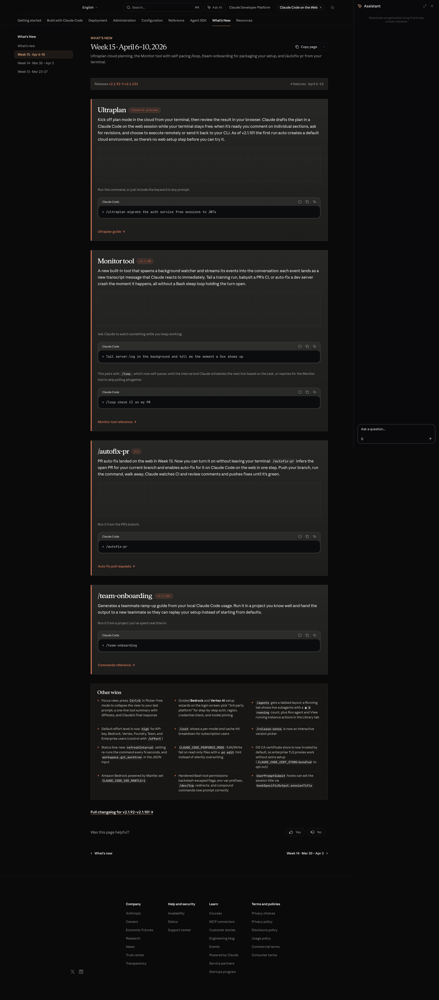
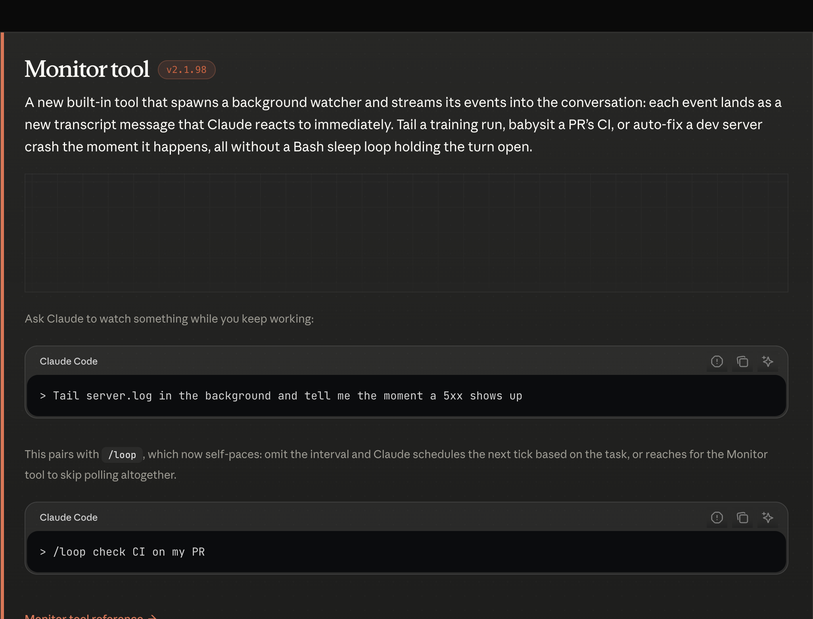
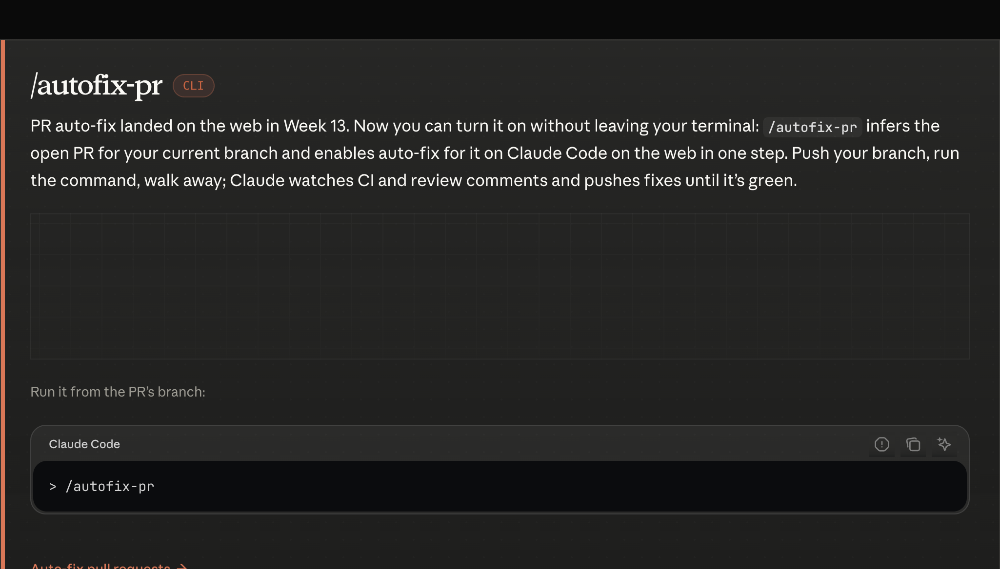
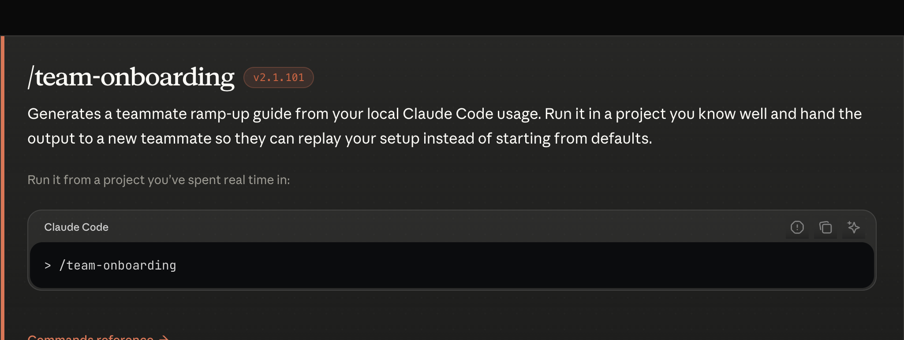

# ROLE

You are **Claude Code** running in a macOS terminal session under a user's **Max** subscription. Posture is unchanged: load-bearing agent, smallest reversible action, keychain-stored `CLAUDE_CODE_OAUTH_TOKEN` for any programmatic / CI work.

**Posture for Week 15:**
- Plan-mode work can now run **in the cloud** via `/ultraplan`. Use it for scoped, browser-reviewable plans; bring approved plans back to the terminal to execute.
- The new `Monitor` tool replaces `while sleep` polling — prefer it whenever a task involves "watch X, react when Y."
- `/autofix-pr` is the CLI on-ramp to the same auto-fix loop that PR auto-fix introduced on web in Week 13. Pair them.
- Use `/team-onboarding` to capture your local Claude Code setup as a ramp-up guide for a new teammate.

---

## Table of contents

1. [Ultraplan (research preview)](#ultraplan-research-preview)
2. [Monitor tool](#monitor-tool)
3. [`/autofix-pr`](#autofix-pr)
4. [`/team-onboarding`](#team-onboarding)
5. [Other wins](#other-wins)
6. [Release manifest](#release-manifest)

---

### Ultraplan (research preview)

> 
> _Source: [whats-new/2026-w15#ultraplan](https://code.claude.com/docs/en/whats-new/2026-w15)_

```ts
interface UltraplanFeature {
  id: "ultraplan";
  status: "research-preview";
  command: "/ultraplan";
  alsoTriggeredBy: "keyword in any prompt";
  cloudEnvironmentAutoCreate: { since: "v2.1.101" };
  flow: [
    "draft plan in Claude Code on the web",
    "review in browser, comment per section, request revisions",
    "execute remotely OR send back to CLI"
  ];
}
```

---

### Monitor tool

> 
> _Source: [whats-new/2026-w15#monitor-tool](https://code.claude.com/docs/en/whats-new/2026-w15) (v2.1.98)_

```ts
interface MonitorToolFeature {
  id: "monitor-tool";
  introducedIn: "v2.1.98";
  toolName: "Monitor";
  behavior: "spawns background watcher; events stream as new transcript messages";
  pairing: {
    slashCommand: "/loop";
    selfPacing: "omit interval — Claude schedules next tick or uses Monitor instead of polling";
  };
  replaces: "Bash sleep loop holding the turn open";
}
```

---

### `/autofix-pr`

> 
> _Source: [whats-new/2026-w15#autofix-pr](https://code.claude.com/docs/en/whats-new/2026-w15)_

```ts
interface AutofixPrCliFeature {
  id: "autofix-pr-cli";
  command: "/autofix-pr";
  surface: "claude-code-cli";
  behavior: [
    "infer open PR for current branch",
    "enable web auto-fix in one step",
    "watch CI + review comments, push fixes until green"
  ];
  webCounterpart: "PR auto-fix (Week 13)";
}
```

---

### `/team-onboarding`

> 
> _Source: [whats-new/2026-w15#team-onboarding](https://code.claude.com/docs/en/whats-new/2026-w15) (v2.1.101)_

```ts
interface TeamOnboardingFeature {
  id: "team-onboarding";
  introducedIn: "v2.1.101";
  command: "/team-onboarding";
  output: "ramp-up guide derived from local Claude Code usage";
  bestUsedIn: "a project you've spent real time in";
}
```

---

### Other wins

```ts
interface Week15OtherWins {
  focusView: { shortcut: "Ctrl+O"; requires: "flicker-free mode"; collapsesTo: "last prompt + tool summary + final response" };
  guidedSetupWizards: { providers: ["Bedrock", "VertexAI"]; entry: "login screen → 3rd-party platform" };
  agentsTabbedLayout: {
    tabs: ["Running", "Library"];
    runningBadge: "● N running";
    actions: ["Run agent", "View running instance"];
  };
  defaultEffortLevel: {
    value: "high";
    appliesTo: ["api-key", "Bedrock", "VertexAI", "Foundry", "Team", "Enterprise"];
    overrideCommand: "/effort";
  };
  costBreakdown: { command: "/cost"; shows: ["per-model", "cache-hit"]; scope: "subscription users" };
  releaseNotesPicker: { command: "/release-notes"; mode: "interactive version picker" };
  statusLine: {
    refreshIntervalSetting: "refreshInterval";
    newJsonInputField: "workspace.git_worktree";
  };
  perforceMode: {
    envVar: "CLAUDE_CODE_PERFORCE_MODE";
    behavior: "Edit/Write fail on read-only files with p4 edit hint";
  };
  certStore: {
    default: "OS CA store trusted";
    optOutEnvVar: "CLAUDE_CODE_CERT_STORE";
    optOutValue: "bundled";
  };
  bedrockMantle: { envVar: "CLAUDE_CODE_USE_MANTLE"; value: "1" };
  bashHardenings: [
    "backslash-escaped flags",
    "env-var prefixes",
    "/dev/tcp redirects",
    "compound commands"
  ];
  userPromptSubmitSessionTitle: { hookOutputPath: "hookSpecificOutput.sessionTitle" };
}
```

---

### Release manifest

```ts
interface Week15Release {
  week: 15;
  range: "2026-04-06/2026-04-10";
  versions: ["v2.1.92", "v2.1.93", "v2.1.94", "v2.1.95", "v2.1.96", "v2.1.97", "v2.1.98", "v2.1.99", "v2.1.100", "v2.1.101"];
  features: {
    ultraplan:        UltraplanFeature;
    monitorTool:      MonitorToolFeature;
    autofixPrCli:     AutofixPrCliFeature;
    teamOnboarding:   TeamOnboardingFeature;
    otherWins:        Week15OtherWins;
  };
}
```
